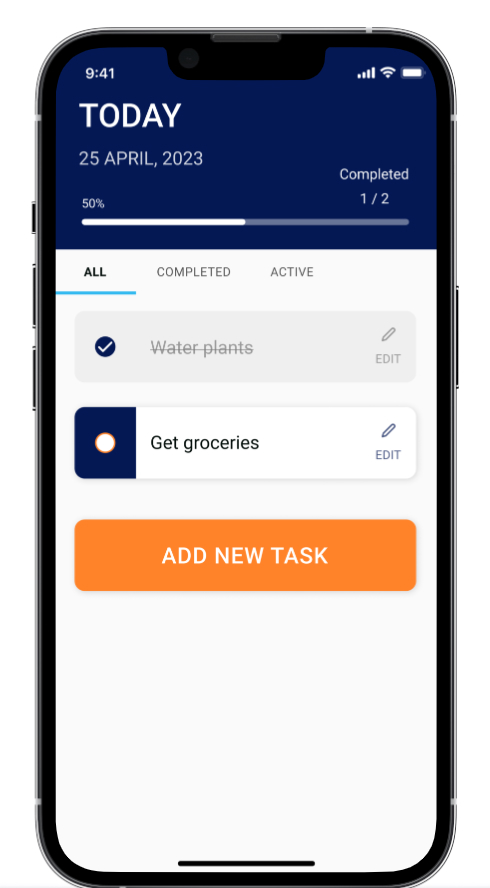
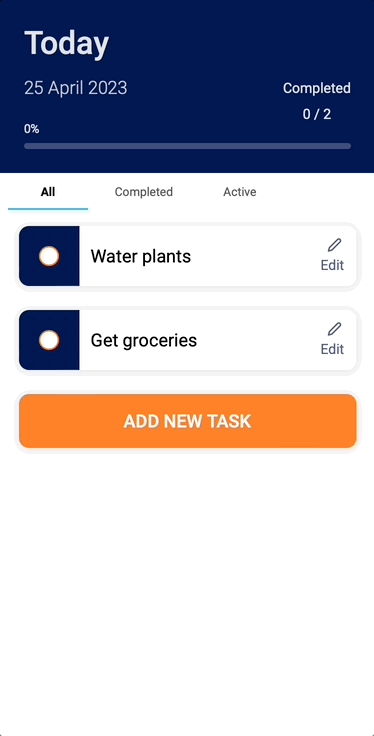
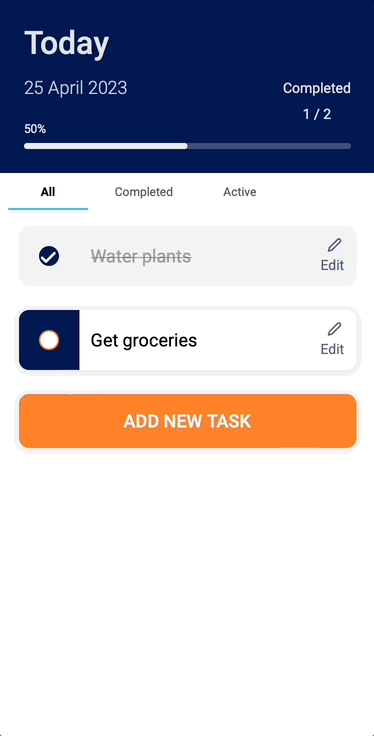
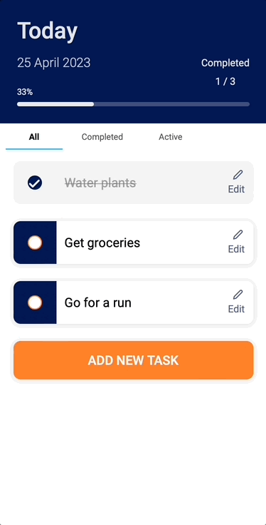
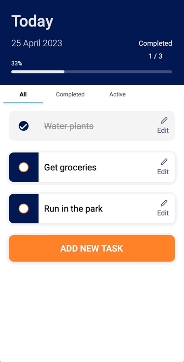

# To-Do App with Vue, Vite and SASS

<div align="center">
  
  <p><em>Mobile-first To-Do App</em></p>
</div>

<!--<div align="center">
  <picture>
    <source media="(max-width: 1199px)" srcset=".png"/>
    <source media="(min-width: 1200px)" srcset=".png"/>
    
  </picture>
  <p>To-Do App</br><em><small>(if viewing on desktop, resize the browser window to see the mobile version)</small></em></p>
</div>-->

</br>

## Table of contents

- [Tools]()
- [Overview](#overview)
  <!--- [Links](#links)-->  
  - [Highlights](#highlights)
- [Build details](#build-details)
  - [Features](#features)
  - [Challenges](#challenges)
  - [What I learned](#what-i-learned)
  - [Continued development](#continued-development)
  - [Useful resources](#useful-resources)
- [Author](#author)

</br>

## Tools


</br>

## Overview

For this project, I created a fully functional to-do app using Vue, Vite and SASS. I focused on creating a simple and intuitive UI that allows users to dynamically add, filter, edit, and delete tasks while tracking their progress with visuals.

My build needed to fulfill the following:

- provide functionality to view a list of to-dos, update completion status, add new tasks, and edit or delete existing tasks 
- track completion progress with multiple visuals available at a glance
- filter tasks by completion status
- mobile-first design

</br>

<!--### Links

View live page: [Vue.js To-Do App]()

</br>-->

### Highlights

- View list of to-dos and mark tasks as completed
  - [View to-do list and mark tasks as completed](#view-to-do-list-and-mark-tasks-as-completed)
- Add new tasks and update task list
  - [Add new tasks](#add-new-tasks)
- Edit or delete existing tasks and update task list
  - [Edit or delete tasks](#edit-tasks-and-update-task-list)
- Filter tasks by completion status
  - [Filter tasks](#filter-tasks)

</br>

</br>

## Build details

### Features

#### *View to-do list and mark tasks as completed*

The home view provides the user with dynamically updating progress trackers in the top header bar, including both numeric and visual indicators to provide a quick progress summary at a glance. 

Next I included filter buttons to allow users to view tasks by completion status (all, completed or active), followed by the list of to-dos with easily accessible buttons to add or edit tasks.

Marking a task as complete provides visual feedback on the task item itself, with a checkmark, strikethrough text and "grayed-out" effect to reduce its visual prominence in the list.

The progress trackers in the header also update whenever a task is added, deleted, or marked complete.

</br>

<div align="center">
  
  <p><em>Marking tasks as completed with visual feedback and updated progress tracking</em></p>
</div>

</br>

#### *Add new tasks*

A large button with descriptive text allows users to add new tasks to the list. On click, the button is replaced with a form for the user to enter the name of the new task. 

Save and cancel buttons are included with contrasting visuals so the user can save the new task, or back out of the action with the cancel button. Saving the task adds it to the list and automatically updates the user's progress.

<div align="center">
  
  <p><em>Adding new tasks to the to-do list</em></p>
</div>

</br>

#### *Edit tasks and update task list*

To edit existing tasks, a user can click the edit button (along with icon) available on each task item. A new form opens and from here the user can update the task, save their changes, delete the task, or cancel.

Consistent layout and styling of buttons across the to-do list (buttons below), task items (button with icon at right), and forms (save and cancel) was intentional to make the app easy to learn and use. Icons were also included with the edit and delete buttons as secondary visual indicators for important actions.

<div align="center">
  
  <p><em>Editing tasks and updating the to-do list</em></p>
</div>

</br>

#### *Filter tasks*

A long list of to-dos can require a lot of scrolling, so I added filter buttons above the to-do list to allow the user to also view tasks by completion status and quickly see what's been accomplished and what tasks are still outstanding.

<div align="center">
  
  <p><em>Filtering to-dos by completion status</em></p>
</div>

</br>

### Challenges

The most challenging part of this project was ensuring the proper flow of props and emitting events between components. I used various levels of nesting with multiple components, thinking not just of how I wanted to organize the component tree for this first iteration, but also keeping in mind how I want to organize and display components across different views in a future build when I create the single-page application (SPA) version.

I also created a number of side-challenges along the way for myself. I added cancel buttons to both the add and edit functions, for example, to make it easy for a user to back out of actions. Small details, like consistent organization and styling of actions and buttons, adding multiple visual indicators for feedback, and auto-closing the add/edit forms upon completion were important to make the interactions feel smooth and intuitive for the user.

The dynamically updating visual progress bar was the part of the build I was most excited to solve. I used computed properties to calculate the (decimal) portion of tasks completed versus total tasks, converted this number to a percentage format then used binding to dynamically update the width of the progress bar as the task list was updated.

</br>

### What I learned

#### *Vue events, methods and models*

Ensuring proper flow of data was a big challenge, and I learned a lot about data handling in this project. Across multiple components I needed to create events to fire when data was submitted, add methods to interact with and display that data on submission, control that data using models. 

One of the more challenging details was passing data to a component that was more than a single level above my initial component, like getting the primary app to update with input data from the Add Task form, for example, which was nested inside the Add Task button. To solve this, I used a combination of custom events, the `$emit` method, and event arguments.  

</br>

#### *Vue computed properties and conditional rendering*

For some aspects of my app, like the filter buttons and progress tracking, I didn't want the values to be recalculated on every render, and instead only wanted them to update when one of their dependencies was changed. I used computed properties to accomplish this.

When creating the filter buttons, for example, I combined event listeners and data binding in the filter buttons component with event handlers and computed properties in the parent component to update the view of the to-do list based on item completion. For example, when the user clicks the "completed" filter button, they are shown the filtered list with only completed items. 

```html
<template>
  <div class="filter-btn-group">
    <button @click="updateFilter('all')" :class="{active: current === 'all'}">All</button>
    <button @click="updateFilter('completed')" :class="{active: current === 'completed'}">Completed</button>
    <button @click="updateFilter('active')" :class="{active: current === 'active'}">Active</button>
  </div>
</template>
```
```js
export default {
  //...
  computed: {
    filterTodos() {
      if(this.current === 'completed') {
        return this.ToDoItems.filter((item) => item.done);
      }
      if(this.current === 'active') {
        return this.ToDoItems.filter((item) => !item.done);
      }
      return this.ToDoItems;
    },
  },
}
```

I nested forms within the `Add` and `Edit` buttons using Vue's `v-if` and `v-else` conditional rendering capabilities. In their initial states, the `Add` and `Edit` buttons would be visible, then toggle to the input forms on click. This allowed me to provide editing capabilities for each individual task item and with a straightforward and consistent process for the user across all form inputs.

</br>


#### *Global and component styling with SASS*

With my design, I had a number of variables I wanted to be inherited across all of my components, so I created global SASS variables for things like color scheme, fonts, and mixins for specific styles I wanted to reuse. By referencing the global variables when I needed them in components, if I needed to change the design I could make a one change in the `_shared.scss` file and it would quickly and easily propagate through my entire build, updating all of my components at once.

I also made use of the styling available globally through the `<style>` tags and used the `scoped` attribute when I wanted to limit the styling locally to just the current component. Using a combination of all three approaches allowed me to set and update global styles, declare styles once and propagate them throughout my build, and maintain the flexibility to individually style unique portions of components as needed.

</br>

### Continued development

In this first iteration, I focused on the fundamentals of the user experience: 
- what functions does a to-do app need to perform to be useful?
- how to design a UI that makes accomplishing these functions feel intuitive and easy to complete? 

My solution was an app that is simple, easy to use, and pays attention to performing its primary purpose well. I'm using an iterative design process to incrementally implement new features, concentrating on functionality and ease-of-use (doing a few things and doing them well) over an extended feature list. 

In the next iteration I plan to incorporate additional design elements (like a confirmation modal for deleting tasks) and development work, adding Vue Router for a single-page application (SPA) version and eventually state management with Pinia as the app grows in size and complexity.

</br>

### Useful resources

- [Vue.js Guide](https://vuejs.org/guide/introduction.html) - Official docs for Vue.js, very helpful for diving into specific topics like props and v-model.
- [Vue.js Examples](https://vuejsexamples.com/) - A collection of apps, sites, clones and plugins created using Vue.js. I found this very useful to see builds and use cases with various tools and seeing different ways others approach a problem gave me ideas to test and refine my own solutions.

</br>

## Author

- Riley - [View Portfolio](https://rileydevdzn.webflow.io)
